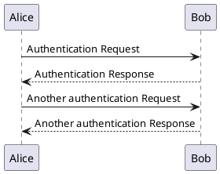
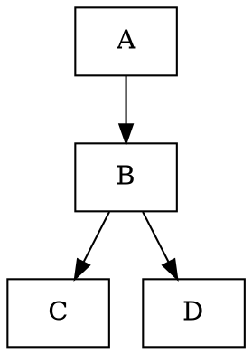

# Extended Diagram Support

This application now supports multiple diagram types through integration with [Kroki.io](https://kroki.io/).

## Supported Diagram Types

In addition to Mermaid, the following diagram types are now supported:

- **PlantUML**: UML diagram creation using a simple text language
- **GraphViz**: Creating structured graphs and diagrams
- **C4PlantUML**: C4 model architecture diagrams
- **Excalidraw**: Hand-drawn style diagrams
- **ERD**: Entity Relationship Diagrams
- **SVGbob**: ASCII to SVG converter
- **nomnoml**: Simple UML diagram editor
- **WaveDrom**: Digital timing diagrams
- **blockdiag**: Simple block diagrams 
- **seqdiag**: Sequence diagrams
- **actdiag**: Activity diagrams
- **nwdiag**: Network diagrams
- **packetdiag**: Packet header diagrams
- **rackdiag**: Rack diagrams
- **UMLet**: UML tool with a simple interface
- **ditaa**: ASCII to diagram converter
- **Vega**: Visualization grammar for data visualization
- **VegaLite**: Simplified version of Vega

## Usage

To create a diagram, use a code block with the language specifier matching one of the diagram types above:

````markdown

````

````markdown

````

## How It Works

The application uses Kroki.io's API to render diagrams:

1. Diagram content is compressed and encoded
2. A request is sent to Kroki.io with the encoded content
3. Kroki.io returns the rendered diagram as an SVG
4. The SVG is displayed in the application

You can also download the diagram as a PNG by clicking the download icon in the top-right corner of the diagram.