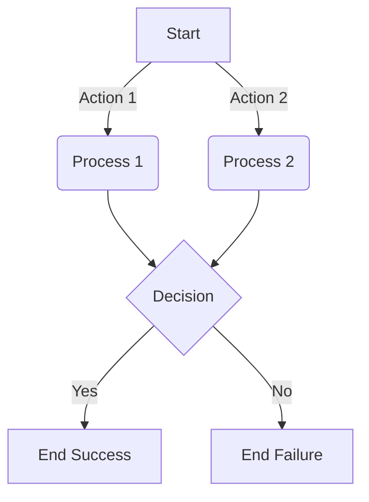
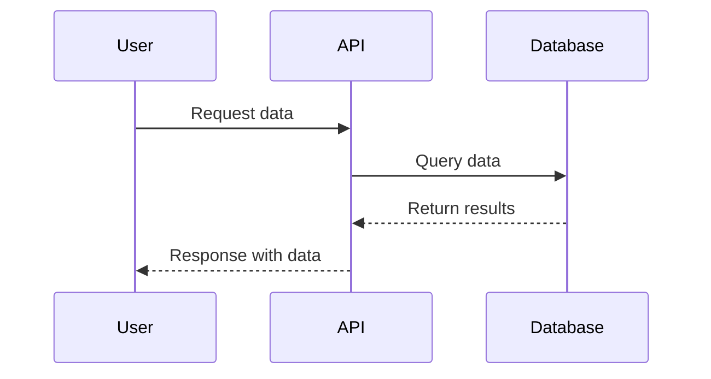
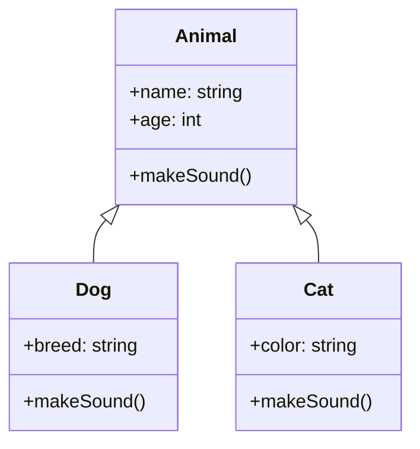
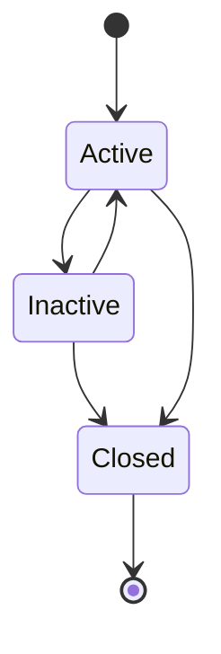

# Mermaid Diagram Test

This is a sample markdown file to test Mermaid diagrams.

## Simple Flowchart

## Sequence Diagram

## Class Diagram

## State Diagram

This page demonstrates the different types of diagrams supported by Mermaid.